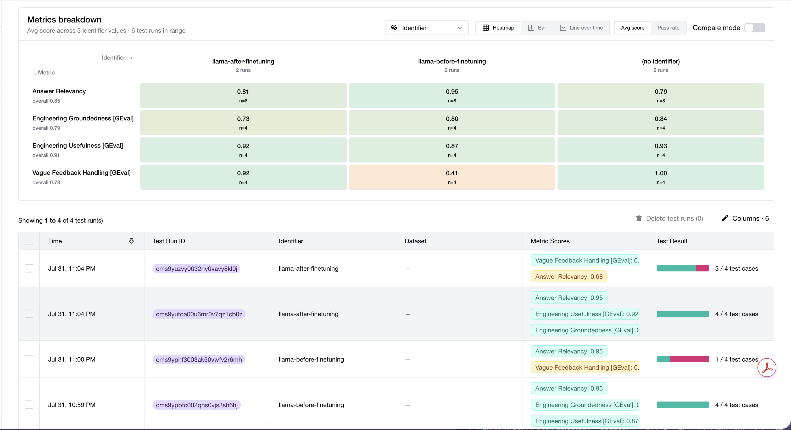
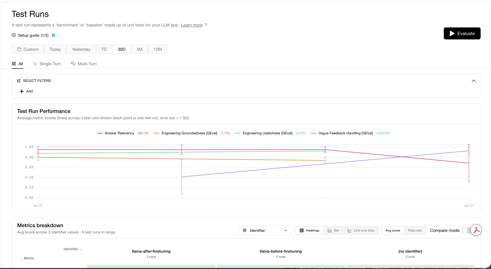

# 🧠 Fine-Tuning Llama 3.1 for Feedback-to-Engineering Insights

A two-agent pipeline that turns raw user feedback into structured engineering insights — fine-tuned locally on Llama 3.1 8B to reduce hallucination on vague inputs. Built with n8n orchestration, local FastAPI inference, and DeepEval evaluation.

---

## 🎯 The Problem It Solves

Product teams get flooded with user feedback — app reviews, support tickets, NPS comments. Turning that into actionable engineering tickets is manual and slow. This pipeline automates it with two specialized AI agents.

But there's a catch: general-purpose models hallucinate on vague feedback. Give a base model "This app is garbage" and it will invent fake bug details, imaginary reproduction steps, and made-up system names. That's dangerous — engineers waste time chasing problems that were never described.

This project fine-tunes Llama 3.1 to fix exactly that failure mode: when feedback is vague, the model should say "insufficient data" and ask for details, not fabricate.

---

## 🧩 Pipeline Architecture

**Two-agent n8n workflow:**

```
User Feedback (chat / review / ticket)
        ↓
Feedback Classifier Agent
  → Extracts: category, severity, affected system, platform,
    sentiment, key phrases, reproduction hints, missing context
        ↓
Engineering Insight Writer Agent
  → Produces: structured engineering ticket with title, type,
    technical summary, reproduction steps, investigation checklist,
    data gaps, priority recommendation
        ↓
Structured Engineering Insight
```

Both agents run on the same fine-tuned Llama 3.1 8B model, served locally.

---

## 🛠️ Tech Stack

| Tool | Purpose |
|------|---------|
| Llama 3.1 8B Instruct | Base model (via Hugging Face) |
| LoRA / PEFT | Parameter-efficient fine-tuning |
| TRL + Transformers | Training framework |
| FastAPI + Uvicorn | Local model inference server |
| ngrok | Exposes local server to n8n cloud |
| n8n | Two-agent workflow orchestration |
| DeepEval (Confident AI) | LLM evaluation framework |
| OpenAI GPT-4o | Evaluation judge model |

---

## 📁 Files

| File | Purpose |
|------|---------|
| `download_hf_model.py` | Downloads Llama 3.1 8B from Hugging Face with 4-bit quantization |
| `fine_tune_training.py` | Fine-tunes both agents with LoRA adapters |
| `merge_to_base_model.py` | Merges LoRA adapters into base model |
| `load_run_local_model.py` | Serves the BASE model as a local API (port 8005, endpoint /v1) |
| `load_run_local_finetune_model.py` | Serves FINE-TUNED models as local API (port 8006, endpoints /v2 classifier, /v3 insight writer) |
| `agent_prompts.py` | Shared system prompts for both agents (single source of truth) |
| `run_full_eval.py` | Runs the fine-tuned model directly and collects all 8 outputs — no n8n/ngrok round-trip needed |
| `props_loader.py` | Reads phase outputs (before / after) from `outputs.properties` |
| `outputs.properties` | Stores all 16 collected outputs (8 before + 8 after fine-tuning) |
| `test_feedback_engineering.py` | DeepEval evaluation suite — reads outputs by `--phase`, logs before/after runs to the dashboard |
| `test_plumbing.py` | Sanity-check script for the local model plumbing |
| `fine_tune_engineering.py` | Original OpenAI fine-tuning script (deprecated — see note below) |
| `training_data_classifier.jsonl` | 15 training examples for the Classifier agent |
| `training_data_insight.jsonl` | 15 training examples for the Insight Writer agent |
| `baseline_outputs.txt` | GPT-4o-mini baseline outputs (Run 1) |
| `llama_base_outputs.txt` | Llama 3.1 base outputs before fine-tuning (Run 2) |
| `finetuned_outputs.txt` | Llama 3.1 fine-tuned outputs (Run 3) |
| `Fine_Tuning_n8n_-_using_local_LLM.json` | n8n workflow pointing to local fine-tuned model |
| `Week - 7 Fine Tuning n8n.json` | n8n workflow pointing to OpenAI (original) |

**Note:** Model weight folders (16GB each) are excluded via `.gitignore`. Run the scripts to regenerate them locally.

---

## ⚙️ Evaluation Automation

The evaluation runs fully automated — no manual copy-paste of model outputs.

1. `run_full_eval.py` calls the fine-tuned model directly and collects all 8 outputs per phase.
2. Outputs are written to `outputs.properties`, keyed by phase (`before` / `after`).
3. `test_feedback_engineering.py --phase before|after` loads those outputs via `props_loader.py`, runs the DeepEval metrics, and logs each run to the Confident AI dashboard with an identifier (`llama-before-finetuning` / `llama-after-finetuning`) so the before/after comparison groups automatically.

```bash
# collect outputs, then evaluate each phase
export OPENAI_API_KEY="sk-proj-..."
python3 test_feedback_engineering.py --phase before
python3 test_feedback_engineering.py --phase after
```

---

## 🚀 How to Reproduce

**Prerequisites:**
- Python 3.11 (NOT 3.14 — PyTorch MPS has a stack overflow bug on 3.14)
- Hugging Face account with Llama 3.1 access approved
- 16GB+ RAM (tested on 64GB Apple Silicon)
- ngrok account
- OpenAI API key (for DeepEval judge)

**Steps:**

```bash
# 1. Install dependencies
pip3.11 install transformers peft trl datasets huggingface_hub bitsandbytes fastapi uvicorn torch deepeval openai python-dotenv

# 2. Set your Hugging Face token in the scripts (HF_TOKEN)

# 3. Download the base model (~16GB, 10 min)
python3.11 download_hf_model.py

# 4. Fine-tune both agents with LoRA (~2.5 hours on Apple Silicon)
python3.11 fine_tune_training.py

# 5. Merge adapters into base models
python3.11 merge_to_base_model.py

# 6. Start the fine-tuned model server
python3.11 load_run_local_finetune_model.py

# 7. In a new terminal, expose it via ngrok
ngrok http 8006

# 8. Update n8n LLM nodes with the ngrok URL
#    Classifier  -> {ngrok-url}/v2
#    InsightWriter -> {ngrok-url}/v3

# 9. Run evaluation (both phases)
export OPENAI_API_KEY="sk-proj-..."
python3.11 test_feedback_engineering.py --phase before
python3.11 test_feedback_engineering.py --phase after
```

---

## 📊 Evaluation Results

Evaluated with DeepEval across 8 test cases: 4 detailed feedback items (F1–F4) and 4 vague feedback items (F5–F8).

**Metrics:**
- **Engineering Groundedness** — does the output stick to what the user actually said?
- **Engineering Usefulness** — is the output actionable for engineers?
- **Answer Relevancy** — is the response relevant to the input?
- **Vague Feedback Handling** — does the model correctly refuse to fabricate on vague input?

### The Key Result — Vague Feedback Handling

| Model | Avg Score | Pass Rate |
|-------|-----------|-----------|
| Llama 3.1 base (before fine-tuning) | 0.41 | 25% (1/4) |
| Llama 3.1 fine-tuned | **0.92** | **100% (4/4)** |

Fine-tuning more than doubled the vague-handling score (0.41 → 0.92) and took the pass rate from 25% to 100% — same model, same architecture, same prompts. The only variable changed was the fine-tuning.

**Before fine-tuning**, "This app is garbage" produced invented bug details, a fabricated platform (mobile-app/iOS), and a P1-CRITICAL priority.

**After fine-tuning**, the same class of input produces:
```
TICKET_TYPE: INVESTIGATION_NEEDED
SEVERITY: LOW
TECHNICAL SUMMARY: Insufficient feedback for engineering action.
INVESTIGATION CHECKLIST: Reach out to user for technical details
PRIORITY: P4 (nothing actionable without user cooperation)
```

No fabrication. Exactly the desired behavior.





### Full Metrics — Before vs After

| Metric | Before | After |
|--------|--------|-------|
| Vague Feedback Handling | 0.41 | **0.92** |
| Engineering Groundedness | 0.80 | 0.73 |
| Engineering Usefulness | 0.87 | 0.92 |
| Answer Relevancy (detailed) | 0.95 | 0.95 |
| Answer Relevancy (vague) | 0.95 | 0.68 |

### Honest Trade-off

The fine-tune bought its vague-handling gain at a real cost: **Answer Relevancy on vague inputs dropped from 0.95 to 0.68** (pass rate 100% → 75%). The fine-tuned model now responds to thin inputs like "Terrible. Just terrible." with a thorough "insufficient data / here's what we need" ticket. That's the correct engineering behavior, but the relevancy judge sees it as not directly engaging the user's complaint, so it scores lower.

Engineering Groundedness on detailed feedback also slipped slightly (0.80 → 0.73, still 100% pass) — the model occasionally adds "INSUFFICIENT DATA" disclaimers even on well-detailed tickets. This is a known consequence of training heavily on vague-refusal examples (over-cautious refusal behavior), and a candidate for the next iteration: rebalancing the training data so caution doesn't bleed into detailed cases.

---

## 💡 Key Learnings

- **Fine-tuning is a last resort, not a first step.** Prompt engineering and evaluation come first. Fine-tuning is for failure modes prompts can't fix — like consistent refusal behavior on vague input.
- **Fine-tuning over-corrects.** Training hard on one behavior (refuse-when-vague) can regress a neighboring one (relevancy). Measuring both is what makes the trade-off visible instead of a silent regression.
- **OpenAI deprecated self-serve fine-tuning** mid-project. The pipeline was migrated from OpenAI GPT-4o-mini to locally-hosted Llama 3.1 8B — a more portable and cost-free approach anyway.
- **Python 3.11, not 3.14.** PyTorch's MPS backend has a stack overflow bug with Python 3.14's recursion handling on Apple Silicon.
- **LoRA makes local fine-tuning feasible.** Full fine-tuning of an 8B model needs enterprise GPUs. LoRA adapters trained on a MacBook in ~2.5 hours.
- **Evaluation is the hard part.** Building a rigorous eval harness with grounded metrics is more valuable and more difficult than the fine-tuning itself.

---

## 🔑 Architecture Decisions

- **Two agents, not one** — separating classification from insight-writing keeps each prompt focused and each model independently tunable.
- **Local inference over cloud API** — no per-token cost, full control, and no dependency on a provider's fine-tuning availability.
- **Separate endpoints per agent** (`/v2` classifier, `/v3` insight writer) — lets each agent load its own fine-tuned weights.
- **DeepEval with custom GEval metrics** — off-the-shelf relevancy isn't enough; groundedness and vague-handling are custom-defined for this use case.

---

## 👤 Author

**Praveen Kumar Jatta** — Senior Technical Program Manager | AI Automation Consultant

- 🌐 [jattaai.com](https://jattaai.com)
- 💼 [linkedin.com/in/praveenjatta](https://linkedin.com/in/praveenjatta)
- 🐙 [github.com/praveenjatta](https://github.com/praveenjatta)

---

## 📄 License

MIT License — free to use and modify with attribution.
